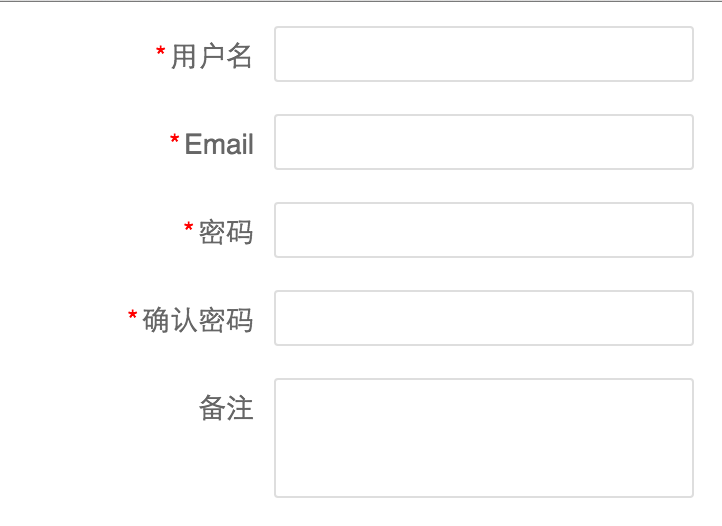

# Schema 使用说明

## 介绍
vue-desktop 项目中 Field 和 Grid 的使用依赖于 Schema，Schema 是 vie-desktop 区别于其他 UI 项目的特点，在使用 vie-desktop 之前，需要先了解 Schema 的概念和用途。

## 简单示例
Schema 用来描述表单里面的一个数据显示使用的 label、数据类型、校验规则等。

先来看一个简单的例子，我们有一个表单是这个样子：



Schema 里面定义的是数据的结构，比如我们这个表单需要这么几个属性：

- userName: 字符串，必填项。
- email: 字符串，必填项。
- password: 字符串，必填项，长度介于6-20。
- confirmPassword: 字符串，必填项，长度介于6-20，需要与 password 一致。
- comment：字符串，可以不填。

那么我们的 Schema 需要这么定义：

```
var userSchema = new Schema({
  userName: {
    label: ‘用户名’,
    whitespace: false,
    required: true
  },

  email: {
    label: ‘Email’,
    required: true
  },

  password: {
    label: ‘密码’,
    required: true,
    minLength: 6,
    maxLength: 20
  },

  confirmPassword: {
    label: ‘确认密码’,
    required: true,
    minLength: 6,
    maxLength: 20,
    rules: {
      type: ‘custom’,
      message: ‘两次输入的密码不一致’,
      validate() {
        return this.password === this.confirmPassword;
      }
    }
  },

  comment: {
    label: ‘备注’
  }
});
```

可以看到，我们在这个 Schema 里面定义了字段的如下信息：
- label：页面上看到的字段信息。
- 校验规则：required、minLength、maxLength等。

## 使用说明

### 属性列表

| 属性 | 说明 |
|------|------|
| type | 数据类型，可选值：string、boolean、number、float、integer、date、datetime。 |
| label | 在页面上显示的文本信息，比如 Field 的 label 或者 Grid 的表头信息。 |
| default | 该字段的默认值。|
| format | 该字段显示为文本的时候使用的格式，目前仅数据类型为 date、datetime 的字段支持该属性。// TODO format 说明 |
| required | 是否必填项目，默认值为 false。|
| whitespace | 是否允许内容为带空格的字符串，默认值为 false。|
| min | 该字段值的最小值，只对 number、integer、float 类型的字段起作用。|
| max | 该字段值的最大值，只对 number、integer、float 类型的字段起作用。|
| minLength | 该字段值的长度的最小值，只对 string 类型的字段起作用。|
| minLength | 该字段值的长度的最大值，只对 string 类型的字段起作用。|
| pattern |  该字段需要匹配的正则表达式。 |
| enum | 该字段值的取值列表，需要定义为数组。比如只能取值 A、B、C，则定义为[ 'A', 'B', 'C' ] |
| messages | 通过属性定义的校验规则都有默认的校验信息，如果不想使用默认的校验信息，可以使用 messages 属性来覆写。比如想覆写 pattern 类型的校验信息，则 messages 定义为 { pattern: '没有通过校验' }|
| rules | 如果通过属性定义的校验规则无法满足需求，可以使用 rules 属性来增加自定义规则。rules 可以是一个数组，也可以是一个对象。rules 里面可以定义两个属性，一个是 message（校验失败后的信息），一个是 validate 方法（校验方法）。|

### 方法列表

| 方法 | 说明 |
| ------ | ------ |
| create | 创建一个空的对象，该对象有 schema 中定义的所有字段，如果 schema 有默认值定义，则空对象该字段的值为默认值。|
| validate(object, options) | 校验 object 是否符合 schema 中定义的规则。 |
| validateProperty(object, property) | 校验 object 的某个 property 是否符合规则。 |
| save(object) | 保存 object 当前的值，可以通过 reset 方法来恢复保存的值。 |
| reset(object) | 恢复保存的 object 的值，如果没有通过 save 方法保存过，则恢复为一个新建的对象。| 
| getPropertyDescriptor(property) | 取得某个 property 的定义。 |
